# ClawClaw
[Click here to visit the published site.](https://ajoedv.github.io/clawcalw/)

## Introduction

Clawclaw is a personal site of a cat named Sylvester. 
Sylvester presnt himself as a founder of a company named ClawClaw and as a Senior Rats Hunter. 
Site made to present and advertise Sylvester's skills and services and what he can offering to his new future family members. 

## Why ClawClaw?

Silvester's claws are his expensive wealth. 
It is his balance and it is his weapon, at the same time. 
It is used in peace and war. 
He uses it to express his love and to defend his family when they need. 

The website is comprised of the following sections: 
1. Home
2. About Me
3. My Skills
4. Adopt Me

From Sylvester standpoint, the goals with the website are:

1. To find a family to adopt Sylvester and give him love and home and make him feel himself a family member.
2. To show the reality of the cats and how much they are lovely and trusted and important.
3. To clarify how much the cat's claws are important to the cat by itself and to his owner at the same time.

From a user standpoint, the goals with the website are:

1. As a first time visitor, I want to find easy-to-read information about the cat Sylvester.
2. As a first time visitor, I want to know what Sylvester has Skills.
3. As a first time visitor, I want to be able to contact Sylvester and arrange meeting to Adopt him and make hime a family member.

## UX

### **Strategy**

Due to the need to find a family to adopt Sylvester. with Considering Selvester's past suffering with his ex-family. and because of the unfair and painful clipping of the cat's claws, and depriving cats of the natural benefits of the claws.
After speaking closely with Sylvester we decided to show how the claws can be valuable in love and in protection, and what Sylvester has skills and how these skills benefit his new family, with very specific site content, and focus on these points:
1. Showing the history of cats in protecting humans for more than 3100 years ago, 365 days a year.
2. showing the benefit by making Sylvester a member of the family and clearfy his skils.
3. Ability for families to contact Sylvester Connect with Sylvester and adopt him
4. showing some of Sylvester's photos in the site.

To decide on features, design and technologies to use in this project, I first focused on the target user:
- Aged 10-80
- Cat lovers
- individuals or families
- People that have problems with mice rats in their homes
- opponents to clipping Cat's claws
- People who value the relationship with pets
- people who believe cats can make mental health better
- who need cats massage

After research into the specified target group the resulte tells these users would need to:

- Clean, modern and inspiring design
- Relevant and easily understood information
- Social Media links for follow up information
- easy way to contact

### **Scope**

Based on the previous points, we settled on the following features for the site:

- Header with a Clawclaw logo and navigation menu for easy access  to each page and section on site.
- big Hero Image of Selvester showing his beauty.
- Sylvester name and his title.
- information about history of cats and personal information about Sylvester.
- photo of Sylvester when his sleeping.
- the benifits of adopting Sylvester and what are his skills.
- contact form for users to connect with Sylvester and send thier interest of adopting him.

### **Structure**

Due to the simplicity of the site's purpose and importance, the site will be a single Page website. and this page will divided into 4 different sections.
- **Hero section** 
contains hero photo of Sylvester and his name and his title.
- **About Me** 
contains inofrmation about the cats history and personal contains 
 information about Sylvester and the benifets of adopting him.
- **My Skills** 
contains most important Sylvester's skills.
- **Adopt Me** 
contains contact form with required information to ensure the connection is made.

### **Skeleton and The Surface plane**

I created design on Adobe Illustrator for the project which being followed by 95%. this design explain the skeleton of the site and in same time it is make the surface plane clear as a final product.

### **Design**
In color psychology, black color meaning is symbolic of mystery, power, elegance, and sophistication. In contrast, the color meaning can also evoke emotions such as sadness and anger.
And also Some positive emotions associated with yellow include happiness, excitement, originality, enthusiasm, confidence, hope, and creativity. Negative feelings connected to yellow are cowardice, illness, caution, betrayal, egotism, and anxiety.
Using black and yellow together means that any negative connotations of either color can be counteracted. Yellow color will be balanced out by the elegance of black. On the other hand, black can balanced out by the cheer and warmth from yellow. Also, the contrast of black and yellow makes the site and the logo pop and grab attention without seeming too loud or annoyingly bright.
  
Font choices was made by doing a search for fonts on google fonts site. my target was to find a clear and readable font and looking good. I chosed *Josefin Sans* i used 700 weight for headings, and for all other bread text i used 400 weight.

## Features

This site is built with a "Desktop size first" and all features scale down to 320px up to any mobile size.  

### **Global Features**
#### **Navbar**
The navbar is featured on the main page, and on the thanks page that made as a responding to form submit. and also on the 404 page - attached to the top of the pages for easy access and easy readability.

- Clickable Clawclaw logo linked to the home page.
- Links to Home, About Me, Skills and Adopt Me Sections.

#### **Footer**
The footer is featured on every page attached to the bottom of the pages - for easy access and easy readability.

- Message from Sylvester to his new family with a promise.and requesting to follow on social media platforms.
- Links to social media sites Facebook, Instagram and Twitter.

### **Home page Features**
the site made by one page and many section . each section linked to the navbar to make site navigation easier for the users. 

The mixing between the dark background, yelllow and white text. and the inspiring hero image fo Sylvester, users will be interested in exploring the site and reading more about Sylvester.

The page is responsive and turns from a one column based structure on the phone devices to being divided into three columns on larger devices, 

#### **Hero Image**
A hero image is Sylvester's photo in black and white To maintain harmony with the background and theme color of the site.

#### **About-Section**
The about section contains Sylvester's photo and history of cats with humans and personal information about Sylvester. 

- Giving a title to Sylvester as a hunter and Lover. to show the mix between the strength and kindness and To show the benefit of making him a member of the family.
- Some words are colored in yellow to highlight the importance, and make it easy to notice.
- Clarifying the historical relationship between cats and humans and its benefits.
- some information about Sylvester and what he can do.

#### **Skills**
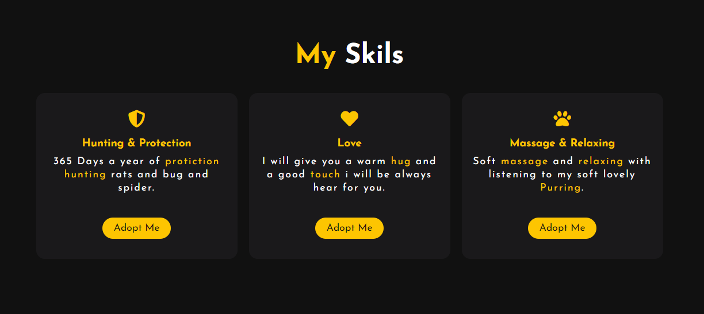
- Explanation of most important skills Sylvester has.
- Three columns contain the three most important Sylvester's skills.
- added icons that expresses each skill.
- added a button under each skill linked to Adopt me  section. to make the action of the decision easier to the users.

#### **Adopt Me**

- Form that asks the user to submit the family name, e-mail address, and a question to the user if he mind to hug and kiss Sylvester, along with a message to send.
- All fields are required and the form will not submit unless all are filled in, to be sure to get a meeting with the future family.
- Reset button to return all fields to their empty starting state.
- Adopt me button to Submit and send the users informations and message.

### **Other Pages**
The site contains two additional pages made to increase usability and make the user experience more enjoyable.

#### **404 Page**

- This page is shown when a user navigates to an unknown/broken page on the site
- The page contains identical header and footer elements as the sites main pages and also button linked to the home page, so that the user will be able to navigate back to the site without the use of the browser back button.
- The page showing a funny photo of 404 number and a prisoner rat in the circle of the O letter, with a funny message telling the users that they have ended up on a dangerous zoon where the most dangerous rats were imprisoned/you can go back to the home page

#### **Thank You Page**

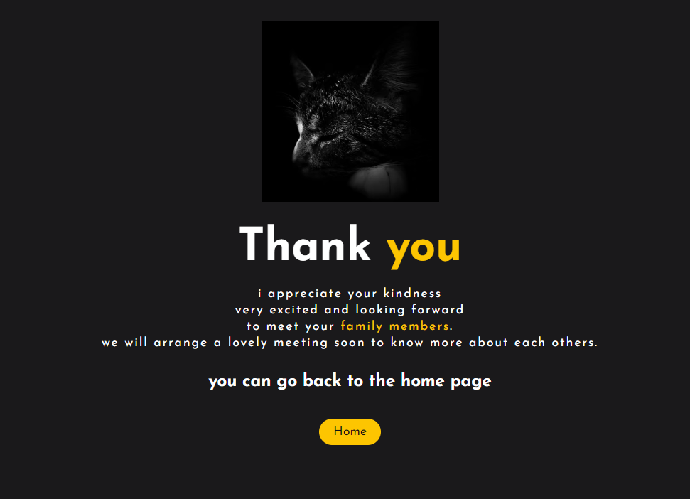

- This page is shown when a user successfully submits the Adopt me form.
- The page contains identical header and footer elements as the sites main pages and also button linked to the home page, so that the user will be able to navigate back to the site without the use of the browser back button.
- The page show Sylvester photo and this message to the user:
( i appreciate your kindness, very excited and looking forward to meet your family members. we will arrange a lovely meeting soon to know more about each others).

### **Future Enhancements**
- Adding a gallery page of Sylvester's photos.
- when When Sylvester is adopted and got his new familly, the Site will upgrad to be just a personal website without Adopt me form.

## Testing

### **Feature Testing**

| Category                | Feature                                                            | Expected                                                                | result |
| ----------------------- |:------------------------------------------------------------------:| -----------------------------------------------------------------------:| ------:|
| Navbar Logo             | Linkes to the home page                                            | Links Lead to Home Page                                                 | true   |
| Navbar                  | Links to Home, About Me, My Skills, Adopt Me. and the hover effect | Links Lead To The Home Page And Sections And Hover Working Perfectly    | true   |
| Footer and Social Icons | Links to Social Media Sites                                        | All Links Lead To The Right Target And Open In New Tab                  | true   |
| Forms Fields            | Family Name, Email, Sylvester Question, Message                    | All Field Are Required and the Type Of The Filed Required               | true   |
| Forms Buttons           | Reset Buttons, Adopt me button                                     | Rest Make Fileds Empty And Adopt Me Submit And Send User To Thanks Page | true   |
| 404 Page                | broken links page                                                  | When User Entering a Brokeb Link He Will Taken to Page 404              | true   |
| Thanks Page             | Confirm of The Form Submission Page                                | When User Submit the Adopt Me Form He Will Taken to Thanks Page         | true   |
| Responsive              | Right Layout and Size, on Desktop,Tablet and Mobile                | All Pages Elements Are Responsive And Right Sisze On All Devices        | true   |

### **Validator Testing**

- HTML - validated using the official W3C Markup Validator. 
    - Index Page Results  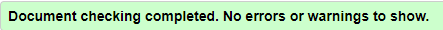
    - 404 Page Results  
    - Thanks Page Results  
- CSS - validated using the official W3C Jigsaw CSS Validation Service.
    - Site Results  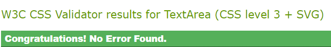

### **Lighthouse**
The site has been tested using the Lighthouse function within Chrome Developer Tools for phone and desktop versions.
- Lighthouse results on index page for desktop version. 

- Lighthouse results on index page for phone version. 
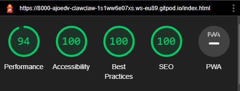
- Lighthouse results on 404 page for desktop version.
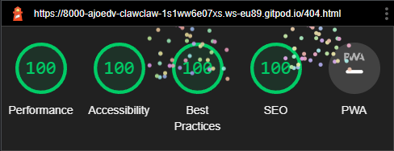
- Lighthouse results on 404 page for phone version. 
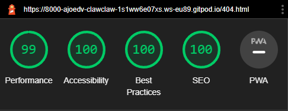
- Lighthouse results on thanks page for desktop version.
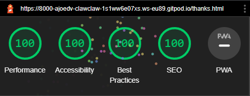
- Lighthouse results on thanks page for phone version. 
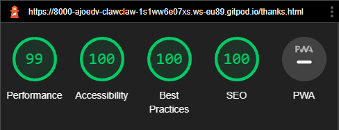

### **Wave**
All pages of the site has been tested using the [Wave Web Accessibility Evaluation Tool](https://wave.webaim.org/) to ensure the site is accessible to individuals with impairments.

   - Home Page.

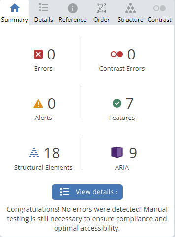
   - 404 Page.
   

   - thanks Page.
   
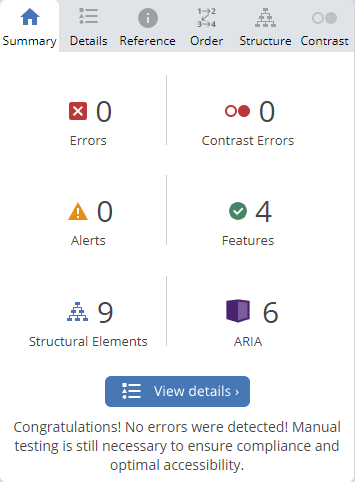

### **Compability**
The site is full responsive and all features and functions has been tested on the following devices and web browsers:

- iPhone 12 pro max
    - Google Chrome
    - Safari
- iPhone SE/12
    - Google Chrome
    - Safari
- Galaxy Note 20 Ultra
    - Google Chrome
    - Samsung Internet
- Galaxy Note 9 Ultra
    - Google Chrome
    - Samsung Internet
- iPad pro
    - Google Chrome
    - Safari
- Macbook pro
    - Google Chrome
    - Safari
    - Firefox
- Windows Desktop
    - Google Chrome
    - Edge
    - Firefox

## Deployment

* The site was deployed to GitHub pages. The steps to deploy are as follows:
  * In the GitHub repository, navigate to the settings tab.
  * From the source section drop-down menu, select the Master Branch.
  * Once the master branch has been selected, the page provided the link to the completed website.

The Live Link To The Project Can Be Found Here.
[ClawClaw](https://ajoedv.github.io/clawclaw/)

